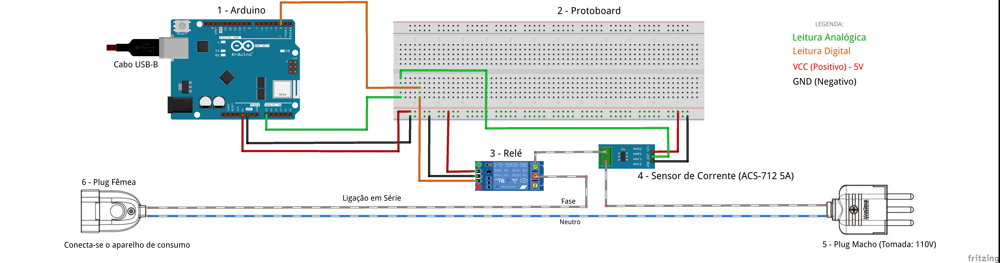

# USO DE INTERNET DAS COISAS

### Monitoramento de energia e controle sobre equipamentos elétricos no meio residencial.

## Sobre

Projeto desenvolvido para o Trabalho de Conclusão de Curso da Universidade Paulista (UNIP) do ano de 2022, sob orientação do Professor Lauro Tomiatti.

<strong>O que é</strong>

 
O projeto visa permitir o monitoramento e controle de energia, possibilitado através da construção de um dispostivo IoT feito com Arduino (ESP8266), onde será mensurado a energia através de sensor de corrente  e controlado a interrupção ou continuação da energia na tomada através de relé. A visualização do consumo em tempo real e comandos de ação de desligar ou ligar a tomada será através de uma plataforma web disponibilizado em nuvem para acesso de usuário que cadastrou o dispositivo em sua conta, permitindo o acesso remotamento da consulta e controle das informações das tomadas monitoradas em sua residência.

<strong>Integrantes do trabalho</strong>

 
<ul>
<li>ALEXANDRE SANTOS CAVALCANTE</li>
<li>AUGUSTO CALISTO DE AQUINO</li>
<li>HELOISA FERREIRA DA SILVA</li>
<li>LUIZ GUSTAVO DE OLIVEIRA DINIZ</li>
<li>RAFAELA DOS SANTOS SILVA</li>
<li>OSCAR LUIZ RODRIGUES DE OLIVEIRA</li>
</ul>

